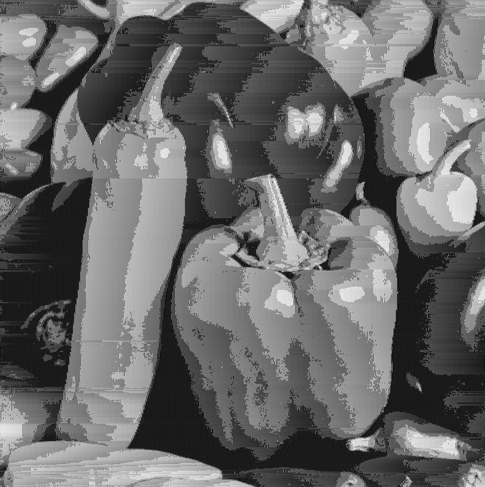
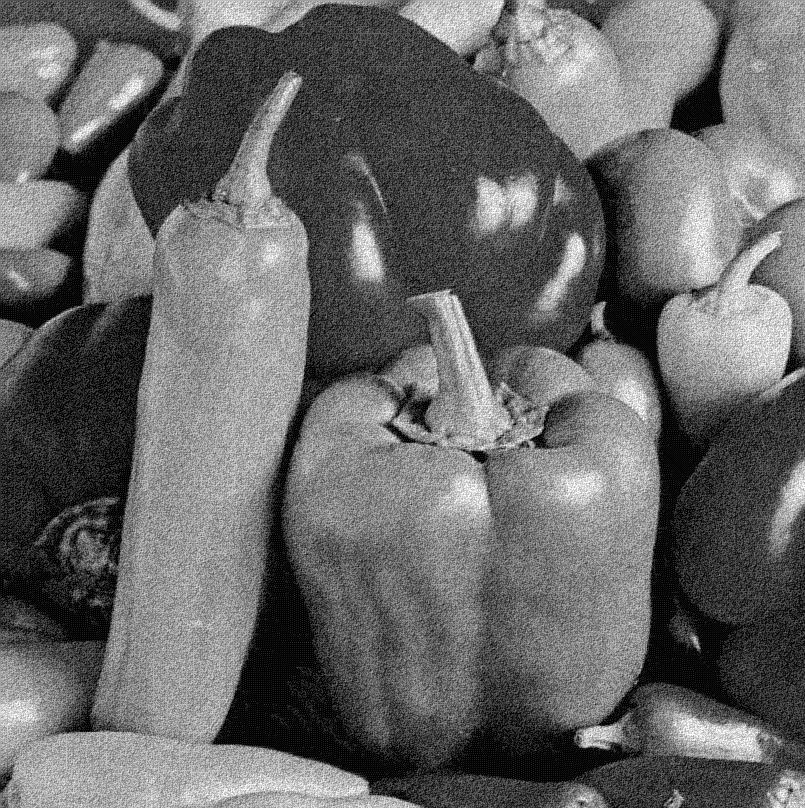

# Image Differential Pulse Code Modulation (DPCM) Implementation

## Overview

This repository contains a Java implementation of the Differential Pulse Code Modulation (DPCM) technique for image compression. DPCM is a predictive coding method that reduces redundancy in image data by encoding the difference between the actual pixel value and a predicted value. Instead of storing the absolute intensity of each pixel, DPCM stores these smaller difference values, leading to potential compression.

The core idea behind DPCM involves these steps:

1. **Prediction:** A predictor estimates the value of the current pixel based on the values of previously encoded (and thus, available at the decoder) neighboring pixels.
2. **Difference Calculation:** The difference (or prediction error) between the actual pixel value and the predicted value is calculated.
3. **Quantization:** The prediction error is then quantized to a limited number of levels. This is a lossy step that introduces compression.
4. **Encoding:** The quantized prediction error is encoded and stored or transmitted.

This implementation includes the following components:

* `DPCM.java`: The main class that orchestrates the DPCM encoding and decoding process. It takes command-line arguments to specify the predictor, quantization levels, and input/output file paths.
* `Encoder.java`: Responsible for the encoding process, including prediction, difference calculation, and quantization.
* `Decoder.java`: Responsible for the decoding process, which involves reversing the quantization and adding the predicted value to the received difference to reconstruct the pixel value.
* `ImageProcessor.java`: Provides utility functions for reading and writing image files.
* `UniformQuantizer.java`: Implements a uniform quantization scheme to reduce the number of bits required to represent the prediction errors.
* `Predictor.java`: An interface defining the contract for different prediction strategies.
* `FirstOrderPredictor.java`: Implements a first-order prediction, where the predicted value of the current pixel is based on the value of its immediate neighbor (e.g., the pixel to its left).
* `SecondOrderPredictor.java`: Implements a second-order prediction, where the predicted value is based on a combination of two neighboring pixels (e.g., the pixel to the left and the pixel above).
* `AdaptivePredictor.java`: Implements an adaptive prediction scheme that likely adjusts its prediction strategy based on local image characteristics.

## Command-Line Usage with `DPCM.java`

The `DPCM.java` class provides a command-line interface for encoding and decoding images using different predictors and quantization levels.

**Encoding:**

```bash
java DPCM.java encode <original file name> <encoded file name> <quantization levels> <predictor>
```

**Decoding:**

```bash
java DPCM.java decode <encoded file name> <decoded file name>
```

## Example Results: Visual Comparison

The `./examples` directory contains the original image and the results of encoding and decoding it using different predictors and quantization levels.

**Original Image:**


---

### Decoded Images (Comparison by Quantization Level)

#### 2-bit Quantization

| First-Order Predictor                                       | Second-Order Predictor                                        | Adaptive Predictor                                    |
| ----------------------------------------------------------- | ------------------------------------------------------------- | ----------------------------------------------------- |
|  |  |  |

#### 8-bit Quantization

| First-Order Predictor                                       | Second-Order Predictor                                        | Adaptive Predictor                                    |
| ----------------------------------------------------------- | ------------------------------------------------------------- | ----------------------------------------------------- |
|  |  |  |

#### 16-bit Quantization

| First-Order Predictor                                         | Second-Order Predictor                                          | Adaptive Predictor                                      |
| ------------------------------------------------------------- | --------------------------------------------------------------- | ------------------------------------------------------- |
|  |  |  |

#### 32-bit Quantization

| First-Order Predictor                                         | Second-Order Predictor                                          | Adaptive Predictor                                      |
| ------------------------------------------------------------- | --------------------------------------------------------------- | ------------------------------------------------------- |
|  |  |  |

