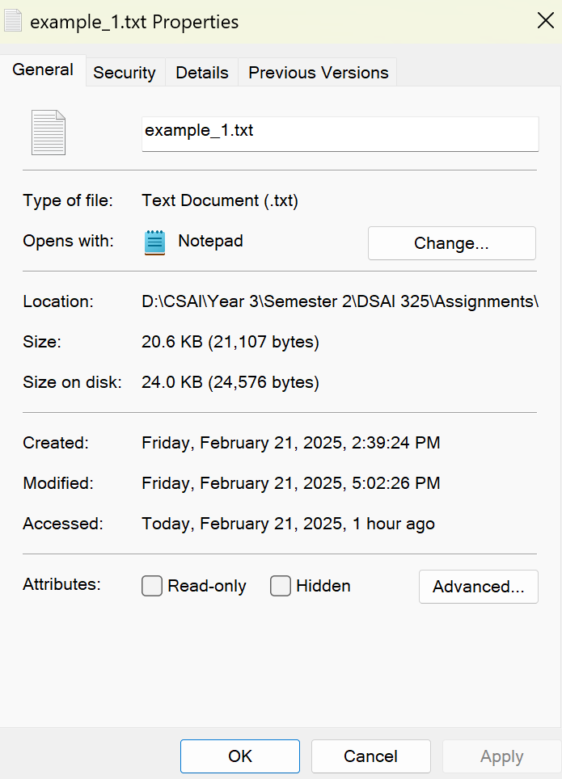
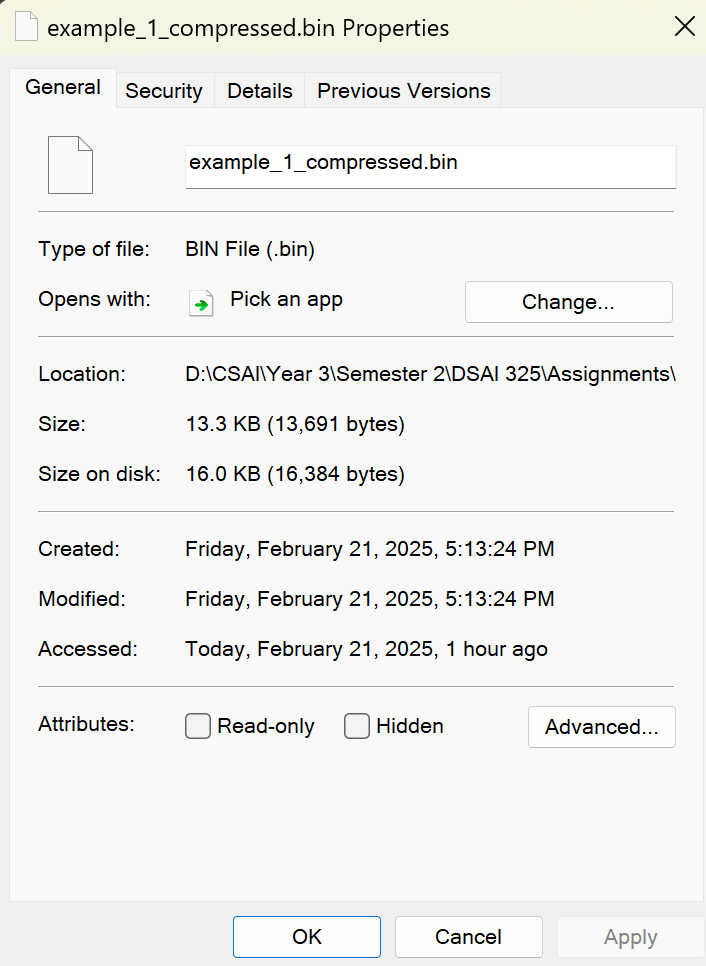
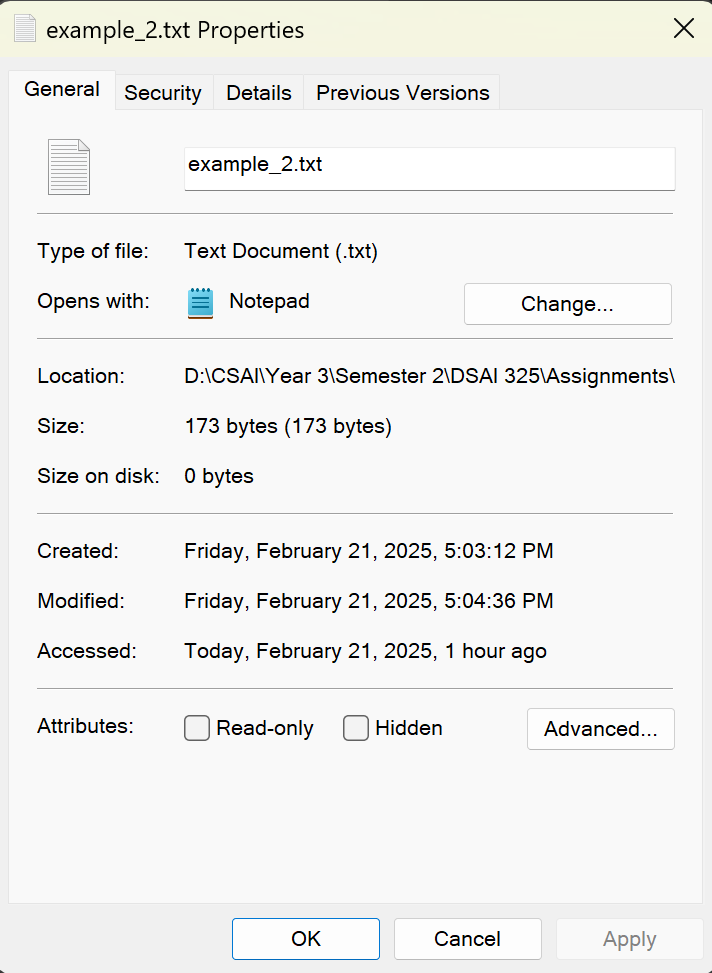
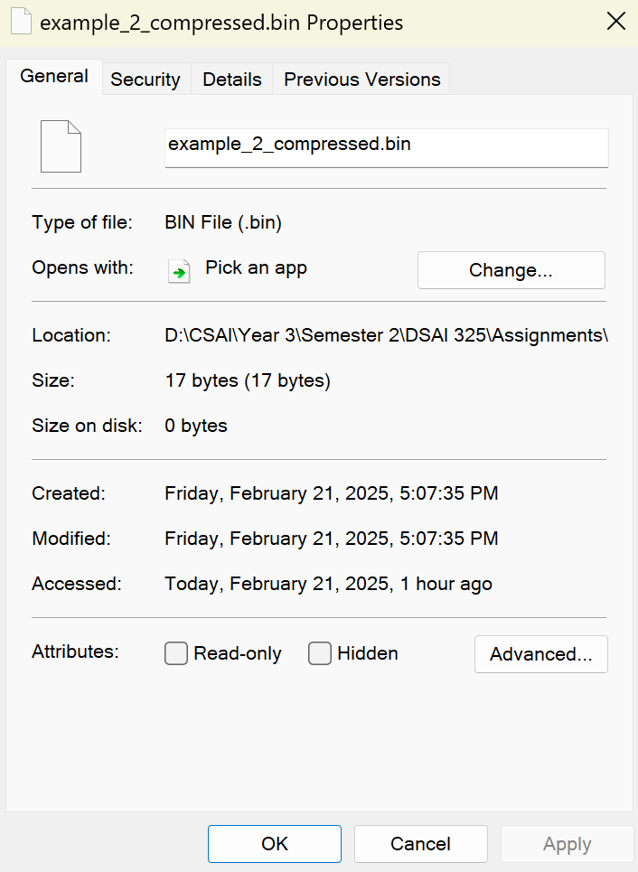
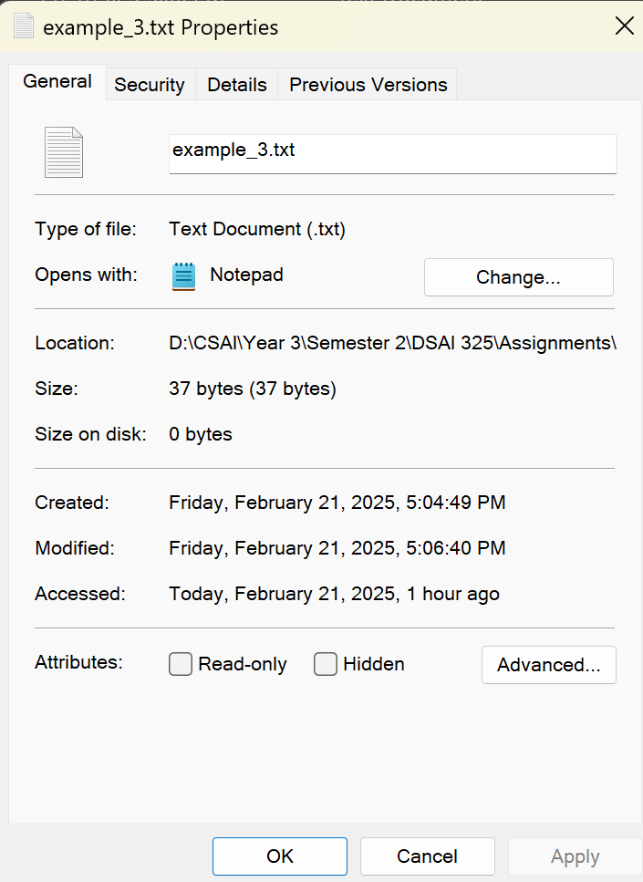
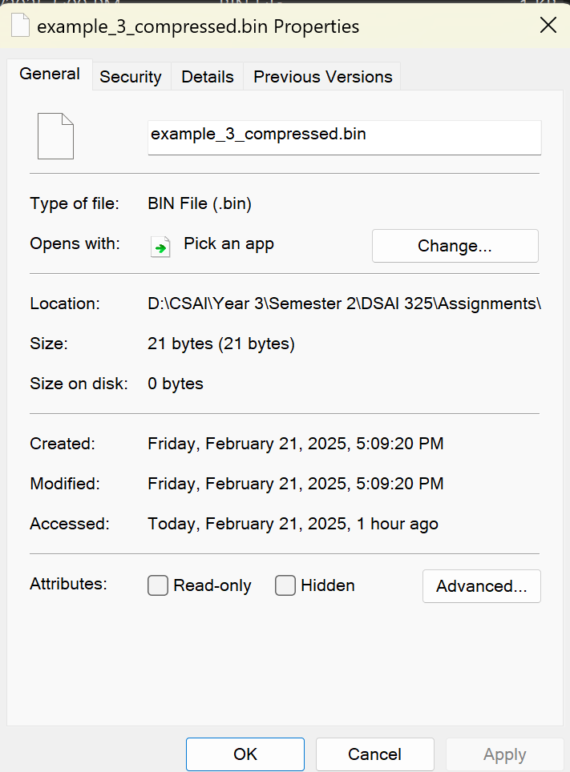

# **Compression using LZ77**

---

## **Description of Work Done**
I implemented LZ77 from scratch using Java. During implementation, I tried to make my code modular, dividing it into three classes: `Compressor`, `Decompressor`, and `IO`.

- The `Compressor` class handles text as a string directly or from an input file and constructs LZ77 triplet tags, with the ability to handle repetitive sequences, and at the end, writes them to a binary file.
- The `Decompressor` class handles tags directly as a list of LZ77 tags or from a binary file, converts them to text again, and at the end, writes the decompressed file to a text file.
- The `IO` class handles reading and writing LZ77 tags in binary files and is used in both the `Compressor` and `Decompressor` classes.
- The main class, `LZ77`, handles the terminal API for compression and decompression.

---

## **API Usage**
Below are the terminal commands used to run the LZ77 compression:

```sh
$ java LZ77.java compress [original file name] [compressed file name]
$ java LZ77.java decompress [compressed file name] [decompressed file name]
$ java LZ77.java help
```

---

## **Test Cases**

### **Test Case 1: Online article about sleeping**
**Before Compression:**  
  
**After Compression:**  
  
**Compression Ratio:** 13 : 20, 65% of original size

### **Test Case 2: 'B' repeated 173 times**
**Before Compression:**  
  
**After Compression:**  
  
**Compression Ratio:** 17 : 173, 10% of original size

### **Test Case 3: Short sequence from repeated different 4 characters**
**Before Compression:**  
  
**After Compression:**  
  
**Compression Ratio:** 21 : 37, 57% of original size

---

## **Future Improvements**
- Limiting the sliding window for efficient processing of long text.
- Parallelizing the tag generation process, as it is an independent process.
- Using the Knuth-Morris-Pratt pattern search algorithm instead of the built-in pattern search to reduce the overhead of searching repetitively for patterns.
