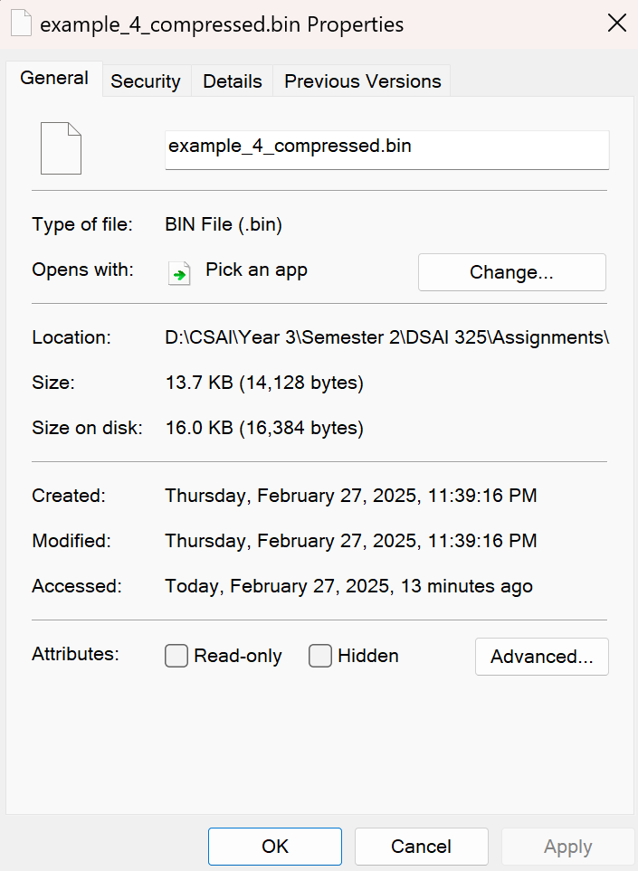
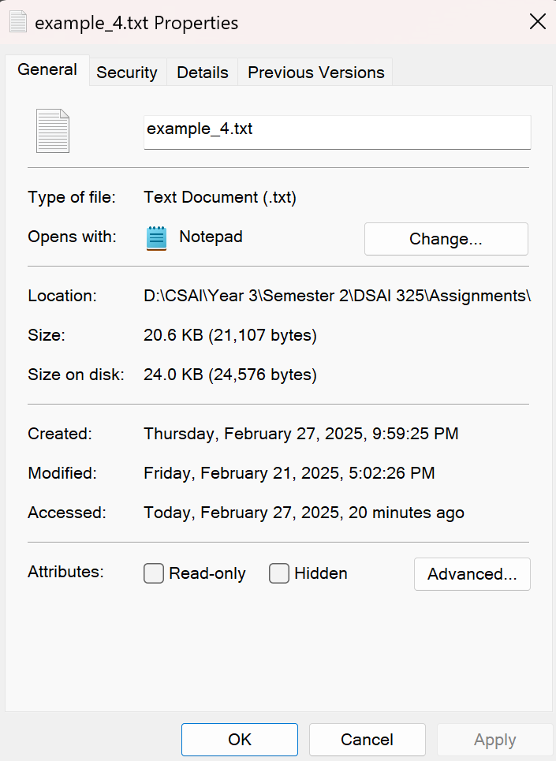
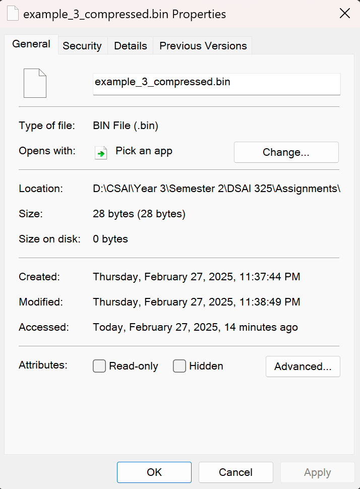
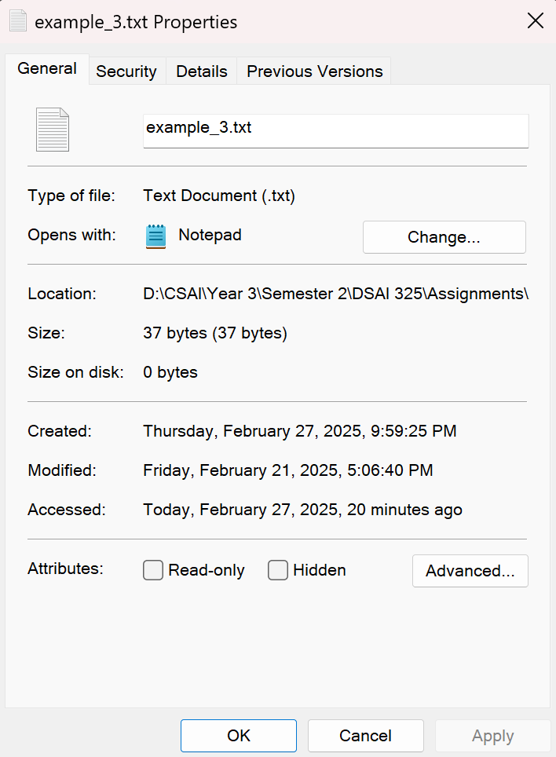
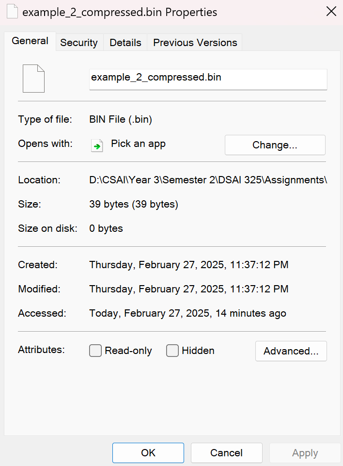
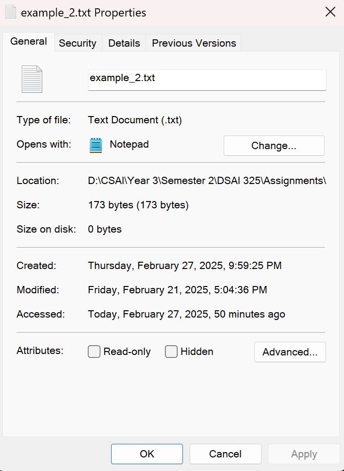
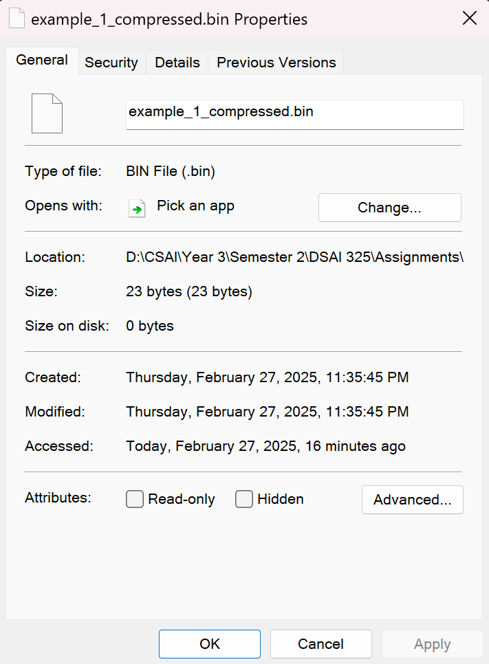
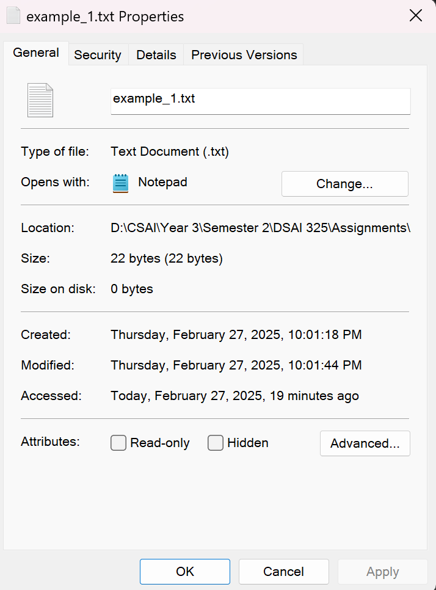

# DSAI 325 Assignment 2: Compression using LZ78 

---

## Description of Work Done
I implemented LZ78 from scratch using Java. During implementation, I tried to make my code modular, dividing it into four classes: `Compressor`, `Decompressor`, `Tag`, and `IO`. 

- The `Compressor` class handles text as a string directly or from an input file and constructs LZ78 pair tags, and at the end, writes them to a binary file.
- The `Decompressor` class handles tags directly as a list of LZ78 tags or from a binary file, converts them to text again, and at the end, writes the decompressed file to a text file.
- The `Tag` class works as a pair data structure that holds LZ78 tag information.
- The `IO` class handles reading and writing LZ78 tags in binary files and is used in both the `Compressor` and `Decompressor` classes.

Our main class, `LZ78`, handles the terminal API for compression and decompression.

---

## API Usage

Below are the terminal commands used to run the LZ78 compression:

```sh
$ java LZ78.java compress [original file name] [compressed file name]
$ java LZ78.java decompress [compressed file name] [decompressed file name]
$ java LZ78.java help
```

---

## Test Cases
you can find them all at examples/

### Test Case 1: Lecture Example
**Before Compression:**  
  
**After Compression:**  
  
**Compression Ratio:** 23 : 22, 104% of original size

### Test Case 2: 'B' repeated 173 times
**Before Compression:**  
  
**After Compression:**  
  
**Compression Ratio:** 39 : 173, 22% of original size

### Test Case 3: Short sequence from repeated different 4 characters
**Before Compression:**  
  
**After Compression:**  
  
**Compression Ratio:** 28 : 37, 76% of original size

### Test Case 4: Online article about sleeping
**Before Compression:**  
  
**After Compression:**  
  
**Compression Ratio:** 13 : 21, 62% of original size
