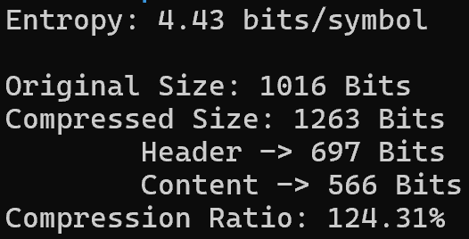
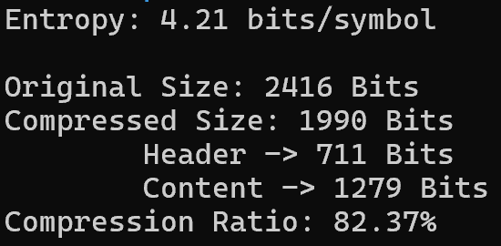
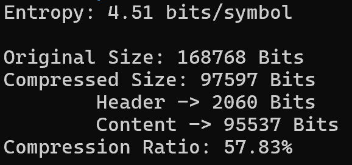

# Standard Huffman Code Compression

## Introduction

Huffman coding is a widely used lossless data compression algorithm. In this implementation, I provided standard Huffman coding from scratch in Java, covering the entire process of compression and decompression.

## Objectives

- Implement Huffman coding for file compression and decompression.
- Provide an efficient and modular Java implementation.
- Evaluate performance through examples.

## API Usage

### Compression

```sh
java Huffman.java compress input.txt output.bin
```

### Decompression

```sh
java Huffman.java decompress output.bin decompressed.txt
```

## Implementation

The implementation is modular and consists of the following classes:

- `Compressor`: Handles file reading, Huffman tree construction, encoding, entropy calculation, and binary file writing.
- `Decompressor`: Reads the binary file, extracts mappings, decodes the text, and writes it back.
- `TreeNode`: Represents nodes in the Huffman tree, including comparison operations for priority queues.
- `Huffman`: Main class that provides an API for compression and decompression.

## Examples

### Example 1

**Title:** Short example

#### Example 1 Screenshot


#### Compression Info for Example 1



### Example 2

**Title:** Medium example

#### Example 2 Screenshot


#### Compression Info for Example 2



### Example 3

**Title:** Very long example

#### Example 3 Screenshot


#### Compression Info for Example 3



## Conclusion

This implementation of Huffman coding provides an efficient approach to text compression and decompression. By evaluating examples, the algorithm's effectiveness in reducing file size while maintaining data integrity is demonstrated especially when increasing file size.

