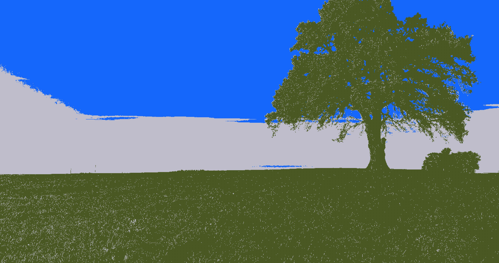
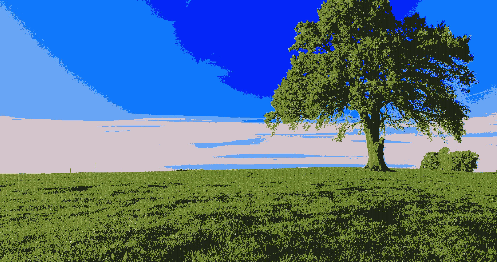

# Vector Quantization Image Compression

## Brief Description

**Vector Quantization (VQ)** is a lossy image compression technique that reduces image size by representing image blocks with a limited set of representative vectors known as a *codebook*. The main idea is to divide an image into fixed-size blocks, encode each block by finding the nearest codebook vector, and store the indices instead of the raw pixel data.

This Java project implements VQ to compress and decompress grayscale images. The compression process generates a codebook of size `k`, while the block size `s` determines the resolution of image patches. By adjusting `k` and `s`, users can explore the trade-off between image quality and compression ratio.

---

## Command Line API

### Compression

**Command:**

```bash
java VectorQuantization.java compress [original file name] [compressed file name] [number of codebook] [block size]
```

**Arguments:**

- `[original file name]` – The path to the input grayscale image to be compressed.
- `[compressed file name]` – The path where the compressed binary output should be saved.
- `[number of codebook]` – The number of vectors in the codebook (`k`). A higher value improves image quality but increases file size.
- `[block size]` – The size `s` of the square image blocks (e.g., 3 for 3×3 blocks).

---

### Decompression

**Command:**

```bash
java VectorQuantization.java decompress [compressed file name] [decompressed file name]
```

**Arguments:**

- `[compressed file name]` – The path to the previously generated compressed file.
- `[decompressed file name]` – The path where the reconstructed image will be saved.

---

### Help

**Command:**

```bash
java VectorQuantization.java help
```

**Description:**

Displays usage instructions and command syntax for compression and decompression.

---

## Examples of Reconstructed Images

The following images demonstrate how different codebook sizes (`k`) and block sizes (`s`) affect image quality:

### Original Image


This is the original grayscale image before compression.

---

### Reconstruction with k=3, s=3



A very small codebook and block size. This results in high compression but poor image quality with visible artifacts.

---

### Reconstruction with k=7, s=3



Slightly improved quality with a larger codebook, but artifacts are still noticeable.

---

### Reconstruction with k=31, s=3


A larger codebook enhances image quality significantly while maintaining a reasonable compression ratio.

---

### Reconstruction with k=31, s=10


Larger blocks reduce spatial detail but increase compression. The quality starts to degrade slightly.

---

### Reconstruction with k=31, s=30


Very large blocks lead to severe quality loss, with major details blurred or lost.

---

### Reconstruction with k=255, s=3


A high-resolution codebook maintains excellent image quality, close to the original, but results in lower compression.

---

### Trade-Off Discussion

In Vector Quantization:

- **Larger `k` (codebook size)** improves fidelity but increases storage size and computational time.
- **Larger `s` (block size)** results in higher compression but often leads to a loss of fine details.

Optimal values depend on the application's storage constraints and quality requirements.

---

Feel free to experiment with different `k` and `s` values to better understand how they affect image compression and quality.
